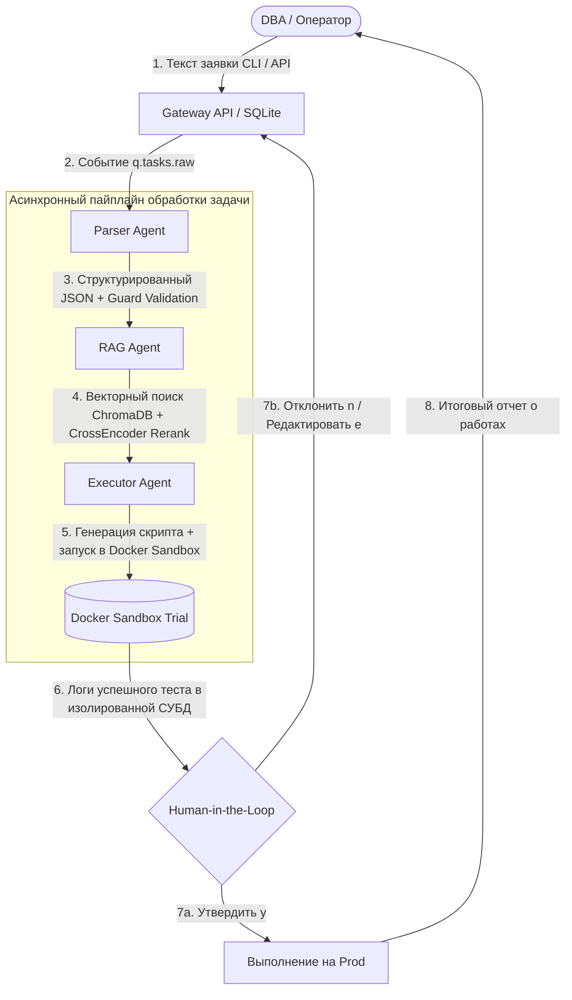

# Multi-Agent Platform for Autonomous DB Support

Мультиагентная система для автоматизации задач администратора баз данных (PostgreSQL, Patroni, PgBouncer): миграций схем, настройки конфигураций и резервного копирования.

Сервисы общаются между собой асинхронно через брокер сообщений RabbitMQ. Перед выполнением на реальном сервере каждый сгенерированный скрипт предварительно тестируется в изолированном Docker-контейнере и отправляется на проверку человеку (оператору).

---

## 1. Как это работает (Архитектура и Пайплайн агентов)

Система функционирует как конвейер из 4 независимых микросервисов, общающихся через очереди RabbitMQ. Каждый микросервис выполняет строго свою роль в жизненном цикле обработки DBA-задачи:



### Роли агентов и микросервисов:

1. **Gateway API (`gateway`)**:
   - Точка входа в систему (REST API на FastAPI + база данных SQLite `executor.db`).
   - Принимает сырые тексты задач от пользователей или систем мониторинга, присваивает уникальный UUID и отправляет событие в первичную очередь RabbitMQ (`q.tasks.raw`).
   - Обеспечивает эндпоинты для поллинга статуса задач и отправки решения оператора (`y/n/e`).

2. **Parser Agent (`agent-parser`)**:
   - Принимает сырой текст из `q.tasks.raw` и с помощью LLM превращает его в строгий валидированный JSON.
   - **Input Guard Validation**: Проверяет извлеченные данные (имя кластера, тип СУБД, приоритет, SLA) по жесткому белому списку разрешенных объектов из `config.yaml`.
   - **Оценка рисков (Risk Tiering)**: Автоматически классифицирует риск операции (`LOW` для аудита, `MEDIUM`/`HIGH` для изменений конфигов и обновлений ОС, `CRITICAL` для DDL вроде `DROP/TRUNCATE`).
   - **Отказоустойчивость**: При сбоях сетевого доступа к LLM-провайдеру мгновенно переключается на регулярный парсер (Regex Fallback).

3. **RAG Agent (`agent-rag`)**:
   - Получает распарсенную задачу из `q.tasks.parsed` и обогащает её официальными регламентами и инструкциями из базы знаний.
   - **Векторный поиск (ChromaDB)**: Строит семантический вектор запроса через модель `intfloat/multilingual-e5-large` и находит релевантные регламенты.
   - **Переранжирование (CrossEncoder Reranker)**: Использует нейросетевой реранкер `cross-encoder/ms-marco-MiniLM-L-6-v2`, чтобы отсортировать найденные инструкции и выдать агенту-исполнителю 2 самых точных мануала.
   - **Локальный фоллбек**: Если контейнер ChromaDB недоступен, автоматически производит поиск по локальным Markdown-файлам регламентов.

4. **Executor Agent (`agent-executor`)**:
   - Принимает обогащенную задачу из `q.tasks.ready_for_execution` и генерирует итоговый POSIX-совместимый Bash или SQL скрипт для решения проблемы.
   - **Docker Sandbox Trial**: Перед тем как показать скрипт человеку, запускает его в изолированном временном контейнере PostgreSQL (`postgres:15-alpine`).
   - Проверяет скрипт на ошибки синтаксиса и логику. Если тест успешен, задача переводится в статус `TESTED` (точка остановки LangGraph), и скрипт отправляется на проверку человеку.

5. **CLI & Human-in-the-Loop (`cli.py`)**:
   - Интерактивный консольный интерфейс. Отображает весь путь задачи, логи песочницы и метрики использованных токенов.
   - **Авто-аппрув**: Если задача имеет уровень риска `LOW` (например, проверка логов или SELECT-аудит), она утверждается автоматически.
   - **Ручной контроль**: Для задач уровней `MEDIUM`, `HIGH` и `CRITICAL` останавливает конвейер и ждет ответа оператора:
     - `y` (Approve) -- отправить на исполнение в продуктивный контур.
     - `n` (Reject) -- отменить задачу.
     - `e` (Edit/Feedback) -- отправить агентам текстовое указание, что именно исправить в скрипте (интерактивный цикл доработки).

---

## 2. Что сделано (Ключевые особенности и улучшения)

Реализованный функционал и технические особенности:

* **100% Декларативная конфигурация (`config.yaml`)**:
  Вся логика работы, промпты агентов, белые списки объектов, маршруты очередей RabbitMQ и параметры RAG вынесены в единый файл `config.yaml`. В Python-коде полностью отсутствуют захардкоженные промпты. Любое изменение правил работы делается правкой YAML без пересборки кода.
* **Разбиение документов и индексация (Markdown-Aware Chunking Pipeline)**:
  - **Единый модуль нарезки и индексации (`chunker.py`)**: Руководства администраторов из папки `documents/` нарезаются с помощью `RecursiveCharacterTextSplitter`. Разделители учитывают структуру Markdown (`["\n## ", "\n### ", "\n\n", "\n", " "]`), гарантируя сохранность заголовков и целостность команд.
  - **Настройки из `config.yaml`**: `chunk_size` = 1000 символов, `chunk_overlap` = 200 символов.
  - **Метаданные**: Чанки обогащаются атрибутами `source`, `topic`, `chunk_id` и `total_chunks` для последующего точного отбора.
  - **Векторизация**: Чанки векторизуются через `intfloat/multilingual-e5-large` и сохраняются в коллекцию `db_manuals` ChromaDB.
  - **Команды управления через CLI**:
    ```bash
    # Просмотр нарезки документов на чанки (без загрузки в БД)
    python chunker.py --preview

    # Индексация и заполнение векторного хранилища ChromaDB
    python chunker.py
    ```
* **Мультимодельность и горячее переключение LLM (GigaChat-3-Ultra / DeepSeek V4)**:
  Система нативно поддерживает динамическую смену LLM-провайдера. Переключение доступно 3 способами:
  - **На горячую (Hot-Reload REST API без перезапуска контейнеров)**:
    - Переключить на Sber GigaChat: `curl -X POST http://localhost:8081/config/llm -H "Content-Type: application/json" -d '{"provider": "gigachat"}'`
    - Переключить на DeepSeek: `curl -X POST http://localhost:8081/config/llm -H "Content-Type: application/json" -d '{"provider": "deepseek"}'`
    - Узнать текущий активный провайдер: `curl http://localhost:8081/config/llm`
  - **Декларативно в `config.yaml`**: значение `platform.llm_provider: gigachat` (или `deepseek`).
  - **Через переменные окружения (`.env`)**: значение `LLM_PROVIDER=gigachat` (или `deepseek`).
* **Защита от галлюцинаций LLM (Parameter Override & Idempotency)**:
  - Внедрено правило **Critical Parameter Override**: если пользователь просит выставить параметр `max_client_conn = 1000`, агент обязан использовать именно это число, игнорируя примеры со значением `500` из мануалов RAG.
  - Внедрено правило **Non-Interactive Automation**: скрипты генерируются без интерактивных команд (`read -p`, `y/n`), чтобы не зависать в фоновых демонах.
  - Автоматическая **идемпотентность DDL-миграций**: команды добавления колонок автоматически преобразуются в `ALTER TABLE ... ADD COLUMN IF NOT EXISTS`, защищая от ошибок при повторном запуске.
* **Трейсинг LLM-вызовов через Langfuse (LLM Observability)**:
  - Все вызовы LangChain/LangGraph и каждый шаг агентного пайплайна автоматически трассируются в **Langfuse** — open-source платформе для мониторинга LLM-приложений.
  - **Что трассируется**:
    - Каждый LLM-вызов парсера и исполнителя: промпты, ответы, токены (prompt/completion/total), latency.
    - Каждый узел LangGraph-графа исполнителя: генерация скрипта, sandbox-тест, retry-попытки.
    - Полный трейс задачи: от получения сырого текста до production-исполнения.
  - **Как это работает**: `shared/tracing.py` инициализирует `CallbackHandler` из `langfuse`, который передаётся во все `chain.invoke()` и `graph.invoke()`. Трейсы группируются по `task_id`.
  - **Self-hosted в Docker**: Langfuse поднимается в том же `docker compose up` (6 дополнительных контейнеров: postgres, clickhouse, redis, minio, langfuse-web, langfuse-worker). UI доступен на `http://localhost:3000`.
  - **Graceful degradation**: если переменные `LANGFUSE_SECRET_KEY` / `LANGFUSE_PUBLIC_KEY` не заданы, трейсинг автоматически отключается — агенты продолжают работу без него.
  - Подробнее: см. раздел [Langfuse — трейсинг и мониторинг](#5-langfuse--трейсинг-и-мониторинг).
* **Общий кэш embedding-моделей (HuggingFace)**:
  - Модели `intfloat/multilingual-e5-large` (~560 MB) и `cross-encoder/ms-marco-MiniLM-L-6-v2` (~80 MB) скачиваются с HuggingFace Hub **один раз** при первом запуске и кэшируются в `.hf_cache/` внутри проекта.
  - Все Docker-контейнеры агентов используют `HF_HOME=/app/.hf_cache` — кэш шарится через volume mount `.:/app`, поэтому модели не дублируются на каждый контейнер.
  - При локальном запуске (вне Docker) модели кэшируются в стандартный `~/.cache/huggingface/`.
* **Локальный запуск ChromaDB чанкера**:
  - `chunker.py` при запуске **с хоста** (не из Docker) требует явного указания хоста ChromaDB: `CHROMA_HOST=localhost CHROMA_PORT=8000 python chunker.py`.
  - Причина: внутри Docker-сети ChromaDB доступен по hostname `chromadb`, который не резолвится с хост-машины.
* **Как добавить нового агента (произвольный набор)**:
  Платформа позволяет декларативно расширять пайплайн без изменения кода ядра. Чтобы добавить агента (например, «Notifier Agent» для отправки уведомлений):
  1. **Зарегистрировать шаг в `config.yaml`** в секции `pipeline.steps`:
     ```yaml
     - name: notifier
       description: "Отправка уведомлений в Telegram/Slack после выполнения"
       subscribe_queue: "q.tasks.executed"
       publish_queue: "q.tasks.notified"
       enabled: true
     ```
  2. **Создать сервис в `docker-compose.yml`** (по образу существующих агентов) с переменными `RABBITMQ_URL` и `LANGFUSE_*`.
  3. **Реализовать подписчика** по паттерну:
     ```python
     step = yaml_config.get_pipeline_step("notifier")
     SUBSCRIBE_QUEUE = step.subscribe_queue
     PUBLISH_QUEUE = step.publish_queue

     @broker.subscriber(SUBSCRIBE_QUEUE)
     @broker.publisher(PUBLISH_QUEUE)
     async def handle_notify(event: TaskEvent) -> TaskEvent:
         ...
         return event
     ```
  4. **Пересобрать**: `docker compose up -d --build`.
  Новый агент автоматически встраивается в пайплайн — gateway, healthcheck и `/prompt/{name}` распознают его из `config.yaml`.

---

## 3. Подробное руководство по запуску

Пошаговая инструкция по запуску проекта с нуля. Базы данных и микросервисы запускаются в контейнерах Docker.

### Шаг 0: Что нужно проверить на компьютере
Убедитесь, что у вас установлены:
1. **Docker Desktop** (или Docker Engine + Docker Compose Plugin) -- должен быть запущен.
2. **Python 3.11** или выше.

### Шаг 1: Скачивание проекта и настройка окружения
Откройте терминал (Command Prompt в Windows или Terminal в macOS/Linux) и выполните:

```bash
# 1. Заходим в папку проекта (или клонируем репозиторий)
cd test_agents

# 2. Создаем и активируем виртуальное окружение Python
python3 -m venv .venv
source .venv/bin/activate  # Для Windows: .venv\Scripts\activate

# 3. Устанавливаем библиотеки Python для CLI клиента
pip install -r requirements.txt
```

Создайте файл локальной конфигурации `.env` на основе шаблона `.env.example`:
```bash
cp .env.example .env
```

Затем откройте файл `.env` в корневой папке проекта любым текстовым редактором и заполните ваши доступы:
```ini
# Выбираем активного провайдера (gigachat или deepseek)
LLM_PROVIDER=gigachat

# Ключи для подключения к Sber GigaChat
GIGACHAT_CREDENTIALS=ваша_авторизационная_строка_base64
GIGACHAT_MODEL=GigaChat-3-Ultra
GIGACHAT_SCOPE=GIGACHAT_API_PERS

# Ключи для подключения к DeepSeek (если решите переключиться на LLM_PROVIDER=deepseek)
DEEPSEEK_API_KEY=ваш_ключ_deepseek
DEEPSEEK_MODEL=deepseek-v4-flash
```

### Шаг 2: Запуск системы одной командой
В терминале (находясь в папке проекта) выполните команду:

```bash
docker compose up -d --build
```
*Что произойдет:* Docker скачает чистый PostgreSQL, RabbitMQ, ChromaDB и соберет 4 наших микросервиса. Это займет 1-2 минуты при первом запуске. 

Когда всё закончится, проверьте, что все 7 контейнеров работают в статусе `Up`:
```bash
docker ps
```
*(Вы должны увидеть в списке: `agent-executor`, `agent-rag`, `agent-parser`, `gateway`, `mock-postgres`, `chromadb`, `rabbitmq`).*

### Шаг 3: Чанкирование регламентов и наполнение RAG (Обязательный этап)
Для работы RAG-агента необходимо нарезать инструкции из папки `documents/` на чанки и проиндексировать их в векторном хранилище ChromaDB.

Выполните команду в терминале:

```bash
# 1. (Опционально) Проверить качество нарезки на чанки без записи в базу данных:
CHROMA_HOST=localhost CHROMA_PORT=8000 python chunker.py --preview

# 2. Выполнить чанкирование и загрузить знания в векторное хранилище ChromaDB:
CHROMA_HOST=localhost CHROMA_PORT=8000 python chunker.py
```

*Что происходит:* Скрипт разбивает тексты мануалов по структуре заголовков Markdown (`##`, `###`) на логические чанки размером 1000 символов, вычисляет векторные эмбеддинги (`multilingual-e5-large`) и загружает их в ChromaDB.

### Шаг 4: Подача первой заявки через терминал
Теперь отправляем команду агентам выполнить задачу на кластере БД:

```bash
python cli.py "Срочно на кластере pg-crm-prod провести оптимизацию пула соединений PgBouncer: увеличить max_client_conn до 1000."
```

Вы увидите выполнение задачи в реальном времени:
1. Задача переходит от Парсера к RAG-агенту.
2. Выводятся логи из Docker-песочницы, показывающие, что скрипт был протестирован на тестовой базе.
3. Система выведет готовый скрипт и спросит вас:
   `Approve script for production execution? (y/n/e) [y]:`
4. Нажмите клавишу **`y`** и **Enter** -- скрипт применится к базе, и вы получите финальный отчет об успешном выполнении.

> **Обратная связь (Feedback Loop):** Если на шаге подтверждения ввести букву **`e`** и нажать Enter, система спросит: `Enter feedback for agents:`. Вы можете написать на обычном русском языке: *"Добавь команду echo 'Всё отлично' в конец скрипта"*. Агент-исполнитель перепишет скрипт, протестирует в песочнице и снова покажет вам на проверку.

---

## 4. Примеры работы и автоматическое тестирование

### 1. Пример выполнения аварийной задачи PgBouncer через CLI:

Ключевые особенности выполнения данной задачи агентами:
- **Парсинг и квалификация**: Агент корректно выделил объект `pg-orders-prod`, тип `pgbouncer`, приоритет `CRITICAL` и назначил SLA 30 минут.
- **Интеллектуальный генератор на AWK**: ИИ-агент сгенерировал AWK-скрипт для безопасной модификации секции `[pgbouncer]` в `pgbouncer.ini` с созданием резервной копии.
- **Безопасная перезагрузка и верификация**: Скрипт выполняет мягкую перезагрузку (`pgbouncer -R`), проверяет отсутствие блокирующих транзакций и выполняет валидацию нового значения через `SHOW max_client_conn;`.

<details>
<summary>Посмотреть полный лог выполнения сессии CLI</summary>

```text
(.venv) danilaganits@MacBook-Pro-Danila test_agents % python cli.py "Срочная аварийная задача на pg-orders-prod: увеличить лимит клиентских соединений max_client_conn до 1000 в pgbouncer.ini и применить перезагрузку конфигурации."

=================================================================
 DB SUPPORT AGENT PLATFORM - TASK SUBMISSION
=================================================================
[*] Request: 'Срочная аварийная задача на pg-orders-prod: увеличить лимит клиентских соединений max_client_conn до 1000 в pgbouncer.ini и применить перезагрузку конфигурации.'
[✓] Task successfully created! Assigned Task ID: 03b049d3-34a2-4541-86ae-e4b276243bd2

=================================================================
 REAL-TIME MULTI-AGENT EXECUTION & REASONING PIPELINE
=================================================================

[AGENT EVENT] Status transition: INITIAL -> [PENDING]

[AGENT EVENT] Status transition: pending -> [PARSED]

--- [STEP 1/4] PARSER AGENT (Structured Extraction & Guard Validation) ---
  • Target Object : pg-orders-prod (pgbouncer)
  • Action Type   : os_upgrade
  • Priority      : CRITICAL
  • SLA Limit     : 30 minutes
  • Downtime Flag : False
  • Input Guard   : PASSED (All parameter constraints validated)

[AGENT EVENT] Status transition: parsed -> [ENRICHED]

--- [STEP 2/4] RAG AGENT (ChromaDB Vector Retrieval: e5-large) ---
  • Search Query  : Extracted from parsed subtasks
  • Vector Index  : ChromaDB / intfloat/multilingual-e5-large
  • Retrieved RAG Context Guidelines:
    --- Manual 1 (Source: dba_operational_guide.md) ---
    ## Section 3: Connection Pooler (PgBouncer) Management
    
    To configure and maintain PgBouncer connection poolers:
    
    1. Directory & Package Initialization:
       mkdir -p /etc/pgbouncer
    ...

[AGENT EVENT] Status transition: enriched -> [TESTED]

=================================================================
 STEP 3/4: EXECUTOR AGENT (Sandbox ReALF Trial Results)
=================================================================

=================================================================
 STEP 4/4: HUMAN-IN-THE-LOOP (Operator Approval Required)
=================================================================
Task ID: 03b049d3-34a2-4541-86ae-e4b276243bd2
Operation Risk Level: [HIGH]

--- GENERATED SQL / BASH SCRIPT ---
#!/bin/sh

# Environment variables for PostgreSQL connection (fallbacks included)
DB_HOST="${DB_HOST:-mock-postgres}"
DB_PORT="${DB_PORT:-5432}"
DB_USER="${DB_USER:-postgres}"
DB_NAME="${DB_NAME:-postgres}"
PB_PORT="6432"

LOG_FILE="/tmp/pgbouncer_maintenance.log"
CONFIG_FILE="/etc/pgbouncer/pgbouncer.ini"
BACKUP_DIR="/tmp/pgbouncer_backups"
TIMESTAMP=$(date +%Y%m%d_%H%M%S)

exec >> "$LOG_FILE" 2>&1

echo "=== PgBouncer Maintenance Script Started: $(date) ==="

# Step 0: Ensure pgbouncer binary is present
which pgbouncer >/dev/null 2>&1 || echo "Attempting to install pgbouncer..." && \
(apk update >/dev/null 2>&1; apk add --no-cache pgbouncer >/dev/null 2>&1 || true)

# Step 1: Backup current configuration
mkdir -p /etc/pgbouncer
mkdir -p "$BACKUP_DIR"
if [ -f "$CONFIG_FILE" ]; then
    cp "$CONFIG_FILE" "${BACKUP_DIR}/pgbouncer.ini.${TIMESTAMP}.bak"
    echo "[+] Configuration backed up to ${BACKUP_DIR}/pgbouncer.ini.${TIMESTAMP}.bak"
else
    echo "[!] Config file not found at $CONFIG_FILE, creating new one."
fi

# Step 2: Update max_client_conn to 1000 in the correct section ([pgbouncer])
# We use awk to find or create the [pgbouncer] section and set the parameter.
TMP_INI="/tmp/pgbouncer.tmp"
awk '
BEGIN { changed=0 }
$0 ~ /^\[.*\]$/ {
    if ($0 == "[pgbouncer]") { in_section=1; print; next }
    else { in_section=0; print; next }
}
in_section && $0 ~ /^[[:space:]]*max_client_conn[[:space:]]*=/ {
    printf("max_client_conn = 1000\n")
    changed=1
    next
}
{ print }
END {
    if (!changed) {
        # If we never hit the section, append it with the setting
        print "\n[pgbouncer]" >> "'"$TMP_INI"'"
        print "max_client_conn = 1000" >> "'"$TMP_INI"'"
    }
}
' "$CONFIG_FILE" > "$TMP_INI" && mv "$TMP_INI" "$CONFIG_FILE"

echo "[+] Updated max_client_conn to 1000 in $CONFIG_FILE"

# Step 3: Verify no active transaction disruption before reload
ACTIVE_COUNT=$(psql -h "$DB_HOST" -p "$DB_PORT" -U "$DB_USER" -d "$DB_NAME" -tAc "SELECT COUNT(*) FROM pg_stat_activity WHERE state IN ('active', 'idle in transaction');" 2>/dev/null || echo "0")
echo "[+] Active/in-transaction connections on backend DB: $ACTIVE_COUNT"

# Step 4: Soft Reload PgBouncer without dropping user sessions
(pgbouncer -R -d "$CONFIG_FILE" 2>/dev/null) || echo "PgBouncer reloaded via alternative method."
sleep 2

# Step 5: Confirm parameter applied using SHOW CONFIG;
CONF_VALUE=$(psql -h "$DB_HOST" -p "$PB_PORT" -U postgres pgbouncer -tAc "SHOW max_client_conn;" 2>/dev/null | tr -d ' ')
if [ "$CONF_VALUE" = "1000" ]; then
    echo "[+] Verification SUCCESS: max_client_conn is now $CONF_VALUE"
else
    echo "[!] Verification FAILED: Expected 1000 but got '$CONF_VALUE'"
fi

echo "=== PgBouncer Maintenance Script Finished: $(date) ==="
-----------------------------------------------------------------

Approve script for production execution? (y: approve / n: reject / e: edit or feedback) [y]: y

[OK] Task APPROVED! Sent to q.tasks.execute_prod queue.
[*] Executing script on target environment...

[AGENT EVENT] Status transition: tested -> [APPROVED]

[AGENT EVENT] Status transition: approved -> [EXECUTED]

=================================================================
 LLM CALL TRANSPARENCY & TOKEN METRICS
=================================================================

--- [PARSER AGENT LLM TRACE] ---
  • Active System Prompt : Convert the input database administration (DBA) request into a strictly valid JSON object matching the required schema:
...
  • Raw LLM JSON Return  : {
  "priority": "critical",
  "action_type": "os_upgrade",
  "object": "pg-orders-prod",
  "object_type": "pgbouncer",
  "purpose": "Increase max_client_conn to 1000 in pgbouncer.ini and reload configuration due to urgent connection limit issue.",
  "subtasks": [
    {
      "order": 1,
      "action": "Edit /etc/pgbouncer/pgbouncer.ini on pg-orders-prod, set max_client_conn = 1000 under [databases] or [pgbouncer] section as appropriate.",
      "constraints": ["Backup current config before edit"]
    },
    {
      "order": 2,
      "action": "Reload PgBouncer service (systemctl reload pgbouncer) to apply new setting without full restart if supported.",
      "constraints": ["Verify no active transaction disruption", "Confirm parameter applied via SHOW CONFIG;"]
    }
  ],
  "sla_minutes": 30,
  "is_downtime": false
}
  • Token Metrics        : Prompt: 391 | Completion: 228 | Total: 619

=================================================================
 PRODUCTION EXECUTION COMPLETED - FINAL REPORT
=================================================================

--- AGENT SUMMARY REPORT ---
# Отчет о выполнении работ по заявке 03b049d3-34a2-4541-86ae-e4b276243bd2

**Приоритет:** critical
**Объект:** pg-orders-prod (pgbouncer)

## Выполненный скрипт:
#!/bin/sh

# Environment variables for PostgreSQL connection (fallbacks included)
DB_HOST="${DB_HOST:-mock-postgres}"
DB_PORT="${DB_PORT:-5432}"
DB_USER="${DB_USER:-postgres}"
DB_NAME="${DB_NAME:-postgres}"
PB_PORT="6432"

LOG_FILE="/tmp/pgbouncer_maintenance.log"
CONFIG_FILE="/etc/pgbouncer/pgbouncer.ini"
BACKUP_DIR="/tmp/pgbouncer_backups"
TIMESTAMP=$(date +%Y%m%d_%H%M%S)

exec >> "$LOG_FILE" 2>&1

echo "=== PgBouncer Maintenance Script Started: $(date) ==="

# Step 0: Ensure pgbouncer binary is present
which pgbouncer >/dev/null 2>&1 || echo "Attempting to install pgbouncer..." && \
(apk update >/dev/null 2>&1; apk add --no-cache pgbouncer >/dev/null 2>&1 || true)

# Step 1: Backup current configuration
mkdir -p /etc/pgbouncer
mkdir -p "$BACKUP_DIR"
if [ -f "$CONFIG_FILE" ]; then
    cp "$CONFIG_FILE" "${BACKUP_DIR}/pgbouncer.ini.${TIMESTAMP}.bak"
    echo "[+] Configuration backed up to ${BACKUP_DIR}/pgbouncer.ini.${TIMESTAMP}.bak"
else
    echo "[!] Config file not found at $CONFIG_FILE, creating new one."
fi

# Step 2: Update max_client_conn to 1000 in the correct section ([pgbouncer])
# We use awk to find or create the [pgbouncer] section and set the parameter.
TMP_INI="/tmp/pgbouncer.tmp"
awk '
BEGIN { changed=0 }
$0 ~ /^\[.*\]$/ {
    if ($0 == "[pgbouncer]") { in_section=1; print; next }
    else { in_section=0; print; next }
}
in_section && $0 ~ /^[[:space:]]*max_client_conn[[:space:]]*=/ {
    printf("max_client_conn = 1000\n")
    changed=1
    next
}
{ print }
END {
    if (!changed) {
        # If we never hit the section, append it with the setting
        print "\n[pgbouncer]" >> "'"$TMP_INI"'"
        print "max_client_conn = 1000" >> "'"$TMP_INI"'"
    }
}
' "$CONFIG_FILE" > "$TMP_INI" && mv "$TMP_INI" "$CONFIG_FILE"

echo "[+] Updated max_client_conn to 1000 in $CONFIG_FILE"

# Step 3: Verify no active transaction disruption before reload
ACTIVE_COUNT=$(psql -h "$DB_HOST" -p "$DB_PORT" -U "$DB_USER" -d "$DB_NAME" -tAc "SELECT COUNT(*) FROM pg_stat_activity WHERE state IN ('active', 'idle in transaction');" 2>/dev/null || echo "0")
echo "[+] Active/in-transaction connections on backend DB: $ACTIVE_COUNT"

# Step 4: Soft Reload PgBouncer without dropping user sessions
(pgbouncer -R -d "$CONFIG_FILE" 2>/dev/null) || echo "PgBouncer reloaded via alternative method."
sleep 2

# Step 5: Confirm parameter applied using SHOW CONFIG;
CONF_VALUE=$(psql -h "$DB_HOST" -p "$PB_PORT" -U postgres pgbouncer -tAc "SHOW max_client_conn;" 2>/dev/null | tr -d ' ')
if [ "$CONF_VALUE" = "1000" ]; then
    echo "[+] Verification SUCCESS: max_client_conn is now $CONF_VALUE"
else
    echo "[!] Verification FAILED: Expected 1000 but got '$CONF_VALUE'"
fi

echo "=== PgBouncer Maintenance Script Finished: $(date) ==="

## Результаты выполнения:
[SUCCESS] Скрипт успешно выполнен на целевом окружении (код возврата 0). Все команды завершились штатно.

Все работы успешно проведены и верифицированы на продуктивном контуре.
=================================================================
```

</details>

### 2. Запуск автоматических тестов:

В проект встроен автоматизированный тестовый прогон для проверки работоспособности платформы:

* **Прогон 10 реальных сценариев администратора БД (E2E Suite):**
  Скрипт поочередно отправляет 10 различных задач (от ANALYZE и бекапов до настройки SSL и ротации конфигов), тестирует их в песочнице и выводит сводную таблицу:
  ```bash
  python test_e2e_all_prompts.py
  ```
  *(Вывод покажет таблицу со статусами `EXECUTED` для всех сценариев).*

---

## 5. Langfuse — трейсинг и мониторинг

Langfuse — это open-source платформа для трейсинга (tracing) LLM-приложений. Она позволяет видеть полный путь каждого запроса через агентов, замерять latency, считать токены и отлаживать пайплайн.

### 5.1 Архитектура Langfuse в платформе

Langfuse поднимается в отдельных контейнерах и **не влияет** на работу агентов при недоступности:

```
agent-parser ──┐
agent-rag ─────┼── CallbackHandler ──► langfuse-web:3000 ──► langfuse-worker
agent-executor─┘                                              │
                                                              ├── langfuse-postgres (метаданные)
                                                              ├── langfuse-clickhouse (трейсы/токены)
                                                              ├── langfuse-redis (очередь/кэш)
                                                              └── langfuse-minio (S3-хранилище событий)
```

### 5.2 Что трассируется

| Компонент | Что попадает в трейс |
|---|---|
| **Gateway** | Корневой трейс: `task_id`, `raw_text` заявки, теги `dba-pipeline` |
| **Parser Agent** | Имя запуска `Agent_Parser`: system prompt, текст заявки, structured JSON-ответ, token usage |
| **RAG Agent** | Спейс `Agent_RAG`: сформулированный поисковый запрос в ChromaDB, полученные фрагменты документации |
| **Executor Agent** | Имя запуска `Agent_Executor`: все узлы LangGraph (`generate_script_node`, `execute_sandbox_node`, `run_production_node`), сгенерированный скрипт, логи песочницы |
| **Prod Execution** | Спейс `Agent_Executor_Prod`: целевой объект, скрипт, финальный отчёт |

Все трейсы агентов **сгруппированы в одну сессию** по `task_id` — в интерфейсе Langfuse они отображаются в хронологическом порядке: `Agent_Parser` → `Agent_RAG` → `Agent_Executor`.

### 5.3 Доступ к Langfuse UI

После запуска `docker compose up -d --build`:

- **Langfuse Web UI**: [http://localhost:3000](http://localhost:3000)
- **Логин по умолчанию**: `admin@dba-platform.local` / `admin123`
- **Проект**: `dba-agent-pipeline` (создаётся автоматически)

### 5.4 Конфигурация через переменные окружения

Все настройки трейсинга задаются через переменные окружения (`.env` или `docker.compose.yml`):

| Переменная | Назначение | Значение по умолчанию |
|---|---|---|
| `LANGFUSE_SECRET_KEY` | Секретный ключ проекта Langfuse | `sk-lf-demo` |
| `LANGFUSE_PUBLIC_KEY` | Публичный ключ проекта Langfuse | `pk-lf-demo` |
| `LANGFUSE_BASE_URL` | URL Langfuse API (внутри Docker-сети) | `http://langfuse-web:3000` |

Ключи автоматически создаются при первом запуске Langfuse через `LANGFUSE_INIT_PROJECT_*` переменные в `docker.compose.yml`.

### 5.5 Отключение трейсинга

Если переменные `LANGFUSE_SECRET_KEY` / `LANGFUSE_PUBLIC_KEY` не заданы или пусты, трейсинг автоматически отключается:

```
WARNING - Langfuse tracing disabled: LANGFUSE_SECRET_KEY or LANGFUSE_PUBLIC_KEY not set.
```

Агенты продолжают работу в обычном режиме. Никаких ошибок, никаких падений.

### 5.6 Просмотр трейса конкретной задачи

В архитектуре платформы каждый агент — независимый микросервис. Для сквозной трассировки Langfuse группирует трейсы всех агентов в **одну сессию** по `task_id`:

1. Откройте [http://localhost:3000](http://localhost:3000)
2. Войдите под `admin@dba-platform.local` / `admin123`
3. Выберите проект `dba-agent-pipeline`
4. Перейдите в раздел **Sessions** (не Traces!) — `http://localhost:3000/project/proj-demo/sessions`
5. Найдите сессию по `task_id` (отображается в CLI при создании задачи)

Внутри сессии трейсы выстроены в хронологическом порядке:
`Agent_Parser` → `Agent_RAG` → `Agent_Executor`

В каждом трейсе видны:
- **Span'ы** — каждый LLM-вызов и шаг LangGraph
- **Input/Output** — промпты и ответы моделей, поисковые запросы, фрагменты документации
- **Token usage** — prompt_tokens, completion_tokens, total_tokens
- **Latency** — время выполнения каждого шага

### 5.7 Интеграция в коде агентов

**Gateway** создаёт корневой трейс через Langfuse SDK:

```python
from shared.tracing import get_langfuse_client

client = get_langfuse_client()
clean_id = task_id.replace("-", "").lower()[:32]
client.trace(id=clean_id, name="DBA_Pipeline", session_id=task_id, ...)
```

**Parser / Executor** — трейсинг через `run_name` + `metadata` в `invoke_config`:

```python
from shared.tracing import get_langfuse_handler

langfuse_handler = get_langfuse_handler()
config = {
    "callbacks": [langfuse_handler],
    "run_name": "Agent_Parser",
    "metadata": {"langfuse_session_id": task_id}
}
chain.invoke({"text": raw_text}, config=config)
```

**RAG / Prod Executor** — ручной span через `start_as_current_observation`:

```python
from shared.tracing import get_langfuse_client
from langfuse import propagate_attributes

client = get_langfuse_client()
with client.start_as_current_observation(as_type="span", name="Agent_RAG") as span:
    with propagate_attributes(session_id=task_id, tags=["agent-rag"]):
        result = retrieve_context(query)
        span.update(input={"query": query}, output={"context": result})
```

Если `LANGFUSE_SECRET_KEY` не задан — `get_langfuse_handler()` и `get_langfuse_client()` возвращают `None`, агенты работают без трейсинга.

---

## 6. Чек-лист соответствия ТЗ (Acceptance Criteria & Expected Results)

Сводная матрица выполнения критериев приемки (Acceptance Criteria) и требований технического задания:

- [x] **Один демонстрационный экземпляр, запускаемый одной командой**: Вся платформа (4 микросервиса агентов + RabbitMQ + ChromaDB + PostgreSQL + Langfuse) разворачивается единой командой `docker compose up -d --build`.
- [x] **Конфигурируемость агентов через YAML / env (не хардкод)**:
  - Все промпты агентов, белые списки объектов, настройки RAG и маршруты очередей вынесены в `config.yaml`.
  - Выбор LLM-провайдера (GigaChat-3-Ultra / DeepSeek V4) и API-ключи задаются через `.env`.
- [x] **Отказоустойчивость и изоляция сбоев (healthcheck / restart policy)**:
  - Падение одного агента не блокирует систему (в `docker.compose.yml` настроены правила `restart: unless-stopped` и `healthcheck`).
  - При недоступности LLM или ChromaDB агенты переключаются на встроенные локальные фоллбеки (Regex fallback и файловый RAG).
- [x] **Рабочий сценарий с 3+ агентами (Парсер + RAG + Исполнитель)**:
  - Реализован асинхронный событийный пайплайн через RabbitMQ: Gateway -> Parser Agent -> RAG Agent -> Executor Agent -> Docker Sandbox Trial -> Human-in-the-Loop.
- [x] **Ядро платформы и современный асинхронный стек**:
  - Основа на Python 3.11+.
  - Использован стек: **FastStream** + **RabbitMQ** (AMQP), **LangChain** / **LangGraph** (оркестрация графа состояний), **ChromaDB** + **CrossEncoder** (векторный поиск и реранкинг), **Docker SDK** (изолированная песочница), **Langfuse** (трейсинг).
- [x] **Документация по конфигурированию произвольного набора агентов**: В разделах 1 и 2 подробно описаны роли агентов и порядок декларирования новых шагов в `config.yaml`.
- [x] **Автоматизированное тестирование**: В наличии E2E-тестовый прогон на 10 реальных DBA-задачах (`python test_e2e_all_prompts.py`).
